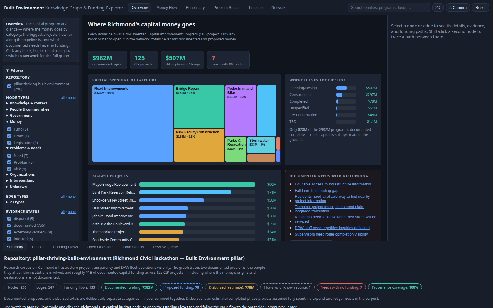

> **Note:** This tool was generated using AI assistance (Claude + Parallel.ai) with human expert review. See [methodology](../docs/methodology.md) for details.

# Knowledge Graph and 3D Funding Explorer

An evidence-backed knowledge graph of the Richmond Built Environment pillar research
corpus, with an interactive 3D explorer for tracing problems, stakeholders, and
funding flows — 296 entities, 547 relationships, 133 financial flows, every material
claim carrying file-level provenance verified at build time.

External research (2026-08-01, `extraction/records/external.json`) answered 2 and
narrowed 7 of the corpus's 20 open questions against official sources — including
the ARPA allocations ($16M Southside / $20M Lucks Field of a $154M city total) and
the CIP funding mix (64% G.O. bonds / 28% federal-state-regional / 8% cash). Answers
appear inline in the Open Questions tab; see
[docs/research-gaps.md](docs/research-gaps.md) for what was closed and what remains.



## Quick start

```bash
cd knowledge-graph
make install     # npm install
make dev         # dev server at http://localhost:5173 (data/ is pre-generated)
```

Full command set:

```bash
make extract     # regenerate data/ from the repository corpus (deterministic)
make validate    # JSON Schema + referential integrity + financial sanity checks
make test        # 54 vitest tests
make build       # production build (runs extract first)
make preview     # serve the production build
make screenshots # headless Chrome validation (27 checks) + screenshots
```

## Using the explorer

- **Overview** (default): the capital program at a glance — a treemap of spending by
  category, the biggest projects, how far along the pipeline is, and the documented needs
  with no funding attached. Click any block, bar, or need to jump into the detail.
- **Network**: the full 3D knowledge graph. Orbit/zoom/pan; click a node or edge for
  details, evidence, and funding paths; shift-click a second node to trace a path; `/`
  focuses search; Escape clears. Low-signal context nodes are dimmed until you engage.
- **Money Flow**: pick a fund/project → every downstream hop highlights, with amounts,
  restrictions, unknown endpoints, a step-through, and a Sankey diagram.
- **Beneficiary**: pick a population → programs serving it, who administers and funds
  them, and which documented needs remain unfunded.
- **Problem Space**: pick a problem → affected groups, interventions, evidence, risks,
  and open questions.
- **Timeline**: scrub across CIP project phases and completion dates.
- Bottom drawer: entity and funding-flow tables (searchable, CSV/JSON export), open
  questions, the data-quality report, and the human review queue. The **2D** button
  switches to an SVG fallback; a plain-text summary of the selection is maintained for
  screen readers.

Visual language: node shape/icon = entity type; line style = evidence status
(solid documented · dashed proposed · dotted inferred · long-dash unverified);
edge width = dollar amount; animated particles = money direction (off under
reduced motion). Full legend in the sidebar.

## Documentation

| Document | Contents |
|----------|----------|
| [docs/architecture.md](docs/architecture.md) | Rendering-library decision, pinned versions, app structure, performance strategy |
| [docs/ontology.md](docs/ontology.md) | Node/edge types, attributes, ID scheme, temporal semantics |
| [docs/evidence-policy.md](docs/evidence-policy.md) | The eight evidence classifications and how they are assigned and displayed |
| [docs/data-methodology.md](docs/data-methodology.md) | Extraction pipeline, automated vs curated, provenance verification, privacy |
| [docs/financial-flow-methodology.md](docs/financial-flow-methodology.md) | Flow model, computed figures, every assumption behind every estimate |
| [docs/problem-space-summary.md](docs/problem-space-summary.md) | Plain-language summary: the problem, the people, the money |
| [docs/research-gaps.md](docs/research-gaps.md) | What the graph cannot answer and what data would close each gap |

## Data outputs (`data/`)

`graph.json` (nodes + edges), `nodes.json`, `edges.json`, `financial_flows.json`,
`evidence.json`, `unanswered_questions.json`, `review_queue.json`,
`extraction_report.json` (data-quality metrics), `schema/graph.schema.json`.
Generated deterministically; committed so the app runs without re-extraction.
